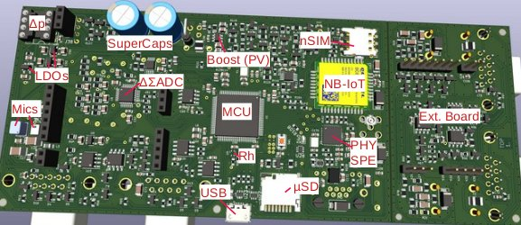

# Sound Observation System (SOS)

## Scope

The task of the project is to locate and classify airborne and structure-borne noise in outdoor areas and to make the characteristics[^1] publicly available in a cloud for later analysis. It is to be understood as a Citizen Science[^2] project. The hardware of this modular sensor system was developed to suit the intended use, is inexpensive and works self-sufficiently with solar cells. The 24/7 operating mode makes it possible to determine the daily and seasonal distribution of sound events. The spatially distributed sensors also enable location correlation. One possible application is the detection and classification of animal sounds. The system helps us to better understand our environment and our influence on it. This is also the basis, for example, for the acoustic design and optimization of habitats for humans and fauna. Acoustic technologies enable 360° data recording and do not require direct visual contact.

Active participation in the project is expressly desired[^3]. In particular, there is a need
for the:
- Development of software for data aggregation at cloud level
- Specification and implementation of data filtering, transparency and security
- Specification, implementation and testing of security concepts for the firmware
- Data evaluation and data assessment (inference) using AI methods at cloud level
- Scaling mechanisms (commissioning of teh system, automatic firmware updates, etc.)

## Synergies
The plan is to network with existing platforms such as SENSOR.COMMUNITY[^4] and AIRROHR[^5]. A sound level meter is already available for this[^6]. The hardware and software of the Sound Observation System (SOS) now also offers, among other things:
- frequency resolution and source localization (frequency and spatial spectrum)
- an NB-IoT radio modem, as a WiFi network is not available everywhere
- operational self-sufficiency

## System concept
The system currently consists of a main module and optional microphone and vibration sensor vibration sensor modules (Figure 1). The main module has up to three sensor line
connections (X, Y, Z) for microphone modules and a connection for a vibration sensor module.
Module communication is currently both digital and, in parallel for test purposes, differential-analog.
differential-analog for test purposes.

Figure 1: System module

A local modular system (Figure 2) is connected to a cloud application via a narrow-band IoT modem (NB-IoT).

Figure 2: Modular local sensor system with cloud connection

A USB 2.0 port on the main module also enables local use as a multi-channel microphone on a PC.

## Functional principle of localization

Sound waves propagate at different speeds depending on the medium. From the time offset, i.e. the phase offset of the signals, they can be spatially separated from each other. The simplest method is triangulation: with three sensors arranged in a triangle, the sensors arranged in a triangle, the location can be determined in the plane spanned by the triangle.

For local positioning (source separation), however, the ESPRIT method [^8] is favored. It has a good resolution over a large angular range and requires only a few microphones.

For source localization, the optimum distance between the individual modules is about half the wavelength to be recorded.

At cloud level, the data from several sensor systems, each consisting of the main and the optional microphone and vibration sensor modules. For this purpose, the
Deterministic Maximum Likelihood [^9] (DML) or a previously mentioned tri- and multilateration can be used. This statistical or geometric approach does not require phase coupling, which is not initially provided by the transmission path from the main module to the cloud. Whether the time stamp signals of the optional GNSS modules are sufficient for synchronizing the sensor systems
with each other is still to be evaluated.

## System modules
The main module (Figures 3 and 4) contains, among other things:
- MEMS sensors [^10] for airborne sound pick-up from 5 Hz to 8 kHz, SNR 63 dBA resp.
64 dBV/Pa
- a differential pressure sensor (measuring range ± 125 Pa) with acoustic low-pass filter (cavity with
KG 50 pipe section) for airborne sound pick-up up to 50 Hz, SNR 48 dB (calculated)
- a synchronous 8-channel 24-bit ΔΣ-ADC with variable amplifiers ("PGA") for the
recording of the MEMS microphone signals
- an air humidity (± 1.5 %) and air temperature sensor (± 0.3 K)
- Ultra-low-power Cortex M33 MCU with 2 MB Flash and 784 KB RAM for signal processing and filtering
signal processing and filtering
- 4 MB EEPROM and μSD card connection
- USB OTG with audio codec UAC1 device
- Single-pair Ethernet (SPE), 1 km range, 10 MBit/s
- NB-IoT wireless modem, nano SIM slot
- Solar module, super cap and 3.6 V backup battery
- Connection for data exchange and power supply for a sensor line (X) and a vibration sensor module

Figure 3: Main module and add-on module (KiCad)

Figure 4: Main module

The main module can be supplemented by an add-on module. Figure 5 shows an example of a module for connecting two sensor lines (Y, Z). It also contains a circuit for galvanically isolated recording of the sheath currents in the supply lines of the microphone modules. The main module
provides two power supplies (3.0 V and 1.85 V) and two UART interfaces for the add-on module.

Figure 5: Add-on module

A local sensor system with localization function is formed by microphone modules (Figure 6) at the sensor line sensor line connections (X, Y, Z). These currently include:
- MEMS and differential pressure sensors
- a synchronous 2-channel 24-bit ΔΣ-ADC
- Ultra-low-power Cortex M33 MCU with 64 KB flash and 32 KB RAM
- 2 connections for daisy-chaining the microphone and vibration sensor modules of a sensor line Modules of a sensor line
- GNSS module (GPS, GLONASS, BeiDou, Galileo) for position detection and as a time base for time synchronization at cloud level

Figure 6: Microphone module

A MEMS-based vibration sensor module (Figure 7, noise value 60 μg / √Hz) for structure-borne sound pick-up up to 100 Hz forms the end of a sensor line.

Figure 7: Vibration sensor module

## Circuit / hardware concept
The internal data lines coming from the MEMS microphones are designed differentially for a good signal-to-noise ratio. The same applies to the external data lines between the microphone modules and the main module. The synchronous digitization of the microphone phase information is available for beamforming algorithms for source localization and separation.

For cost reasons, the PCBs are currently 2-layer with very few vias for the signal and voltage lines and have a largely continuous voltage lines and have a largely continuous ground plane.

The design priorities of the hardware are currently as follows:
1. data quality
2. self-sufficient operation (power requirement)
3. product cost (hardware)
4. operating costs

[^1]: Time averaging anonymizes the raw data. In machine learning, characteristics are also referred to as
[^2]: https://de.wikipedia.org/wiki/Citizen_Science
[^3]: https://github.com/githupsuser/SOS/tree/main
[^4]: https://sensor.community/de
[^5]: https://hardware.prototypefund.de/project/airrohr
[^6]: https://sensor.community/de/sensors/dnms
[^7]: GNSS = Global Navigation Satellite System, f = female, m = male, IoT = Internet of Things /
Wireless interface, SPE = Single-Pair-Ethernet, Main/Mic/Vibr.
[^8]: https://vocal.com/beamforming-2/esprit-algorithm
[^9]: https://en.wikipedia.org/wiki/Maximum_likelihood_estimation
[^10]: https://en.wikipedia.org/wiki/MEMS

